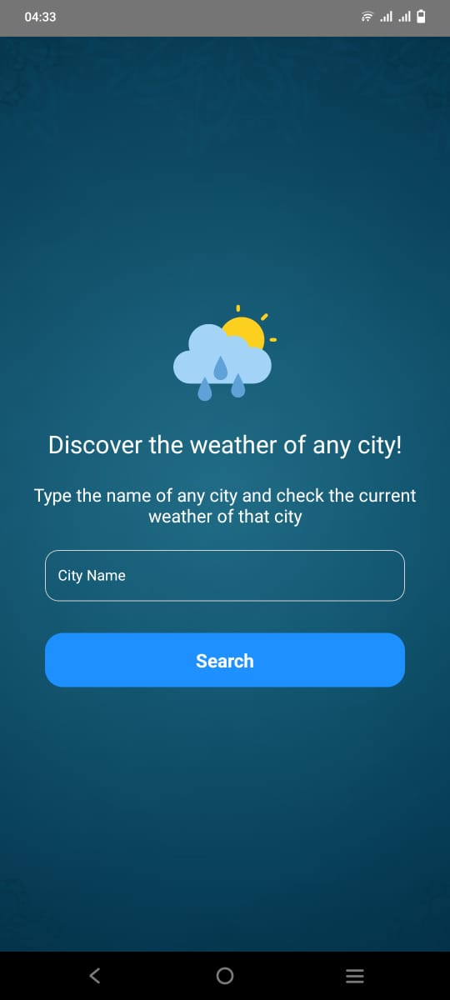
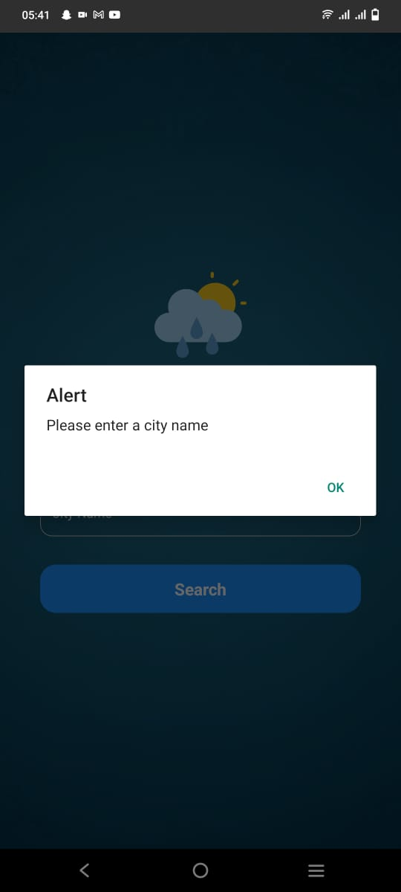
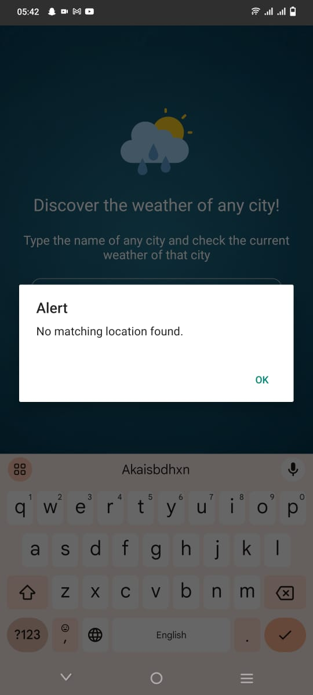
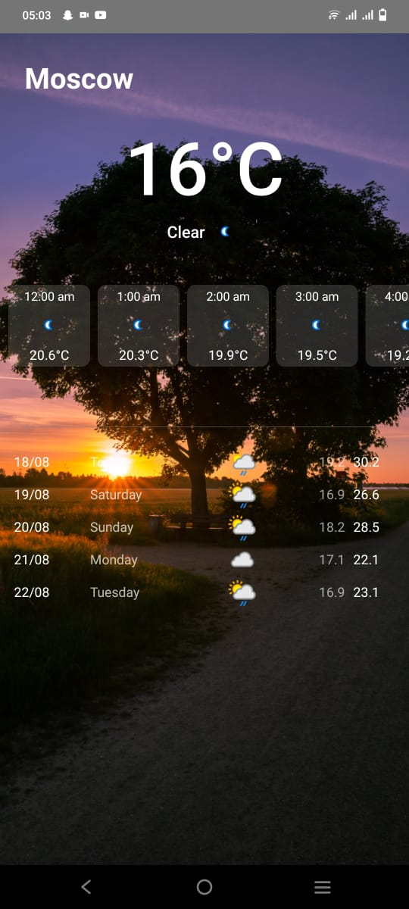
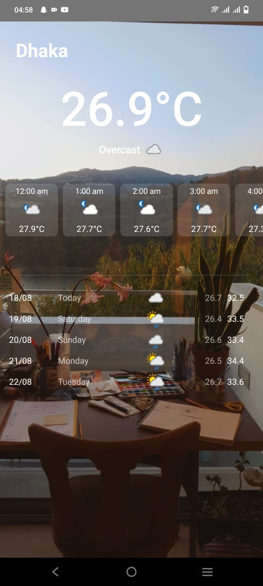
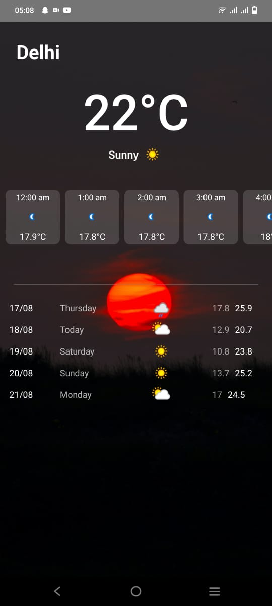
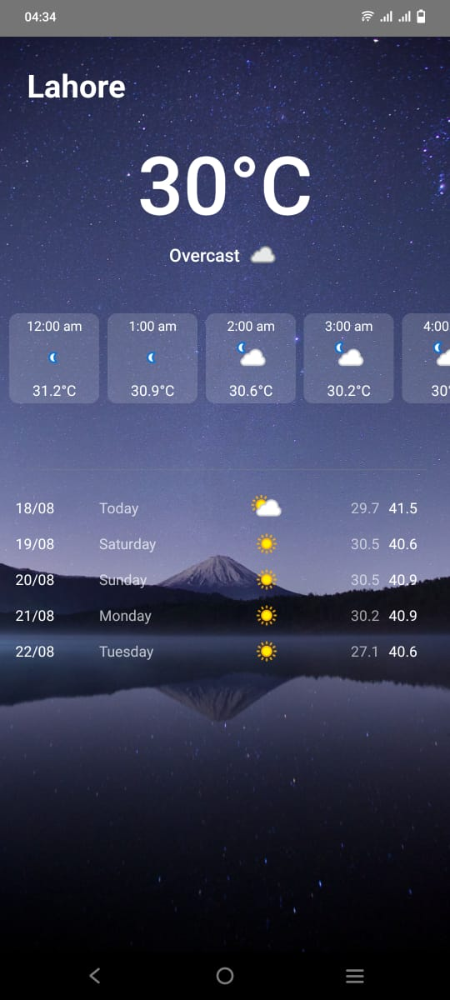

This is a new [**React Native**](https://reactnative.dev) project, bootstrapped using [`@react-native-community/cli`](https://github.com/react-native-community/cli).

# React Native Weather App

This is a simple weather application built using React Native. The app allows users to search for weather information of different cities and view detailed forecasts. In this document, we will discuss the architecture and design choices made in the application.

## Architecture

The application follows a typical structure for a React Native project. It consists of multiple components and screens organized into different files for better code management.

### Components

1. **Home Component**: This component is responsible for rendering the main screen of the app. It includes a text input for users to enter a city name and a button to initiate the weather search.

2. **WeatherDetails Component**: This component displays the detailed weather information for a selected city. It includes the current temperature, weather condition, hourly forecast, and future forecasts for the next few days.

### Screens

1. **Home Screen**: The home screen utilizes the `Home` component. It allows users to input a city name and initiate a weather search by pressing the "Search" button. Upon successful search, users are navigated to the `WeatherDetails` screen.

2. **WeatherDetails Screen**: This screen displays the weather details for the selected city. It uses the `WeatherDetails` component to display the current temperature, weather condition, hourly forecast, and future forecasts.

## Navigation
 I used the @react-navigation library for handling navigation.

## Navigation Setup
Navigation is set up using the @react-navigation/native package along with @react-navigation/stack for stack-based navigation.

The navigation setup is defined in the App.js file.Here's how I've done it:

```js
const App = () => {
  return (
    <NavigationContainer>
      <Stack.Navigator initialRouteName="Home">
        <Stack.Screen name="Home" component={Home} />
        <Stack.Screen name="WeatherDetails" component={WeatherDetails} />
      </Stack.Navigator>
    </NavigationContainer>
  );
};
export default App;

```


## Navigating Between Screens

In the Home screen, I use the useNavigation hook from @react-navigation/native to access the navigation object. When you want to view detailed weather information, I navigate to the WeatherDetails screen and pass the necessary data as props.

## Retrieving Passed Data in WeatherDetails
In the WeatherDetails screen, I use the route prop to access the data passed during navigation.

## Design Choices

### User Interface (UI)

The UI design of the app aims to be user-friendly and visually appealing. Key design choices include:

- **Background Images**: The background image changes dynamically based on the time of day, creating a more engaging user experience.

- **Temperature Display**: The app displays temperature information prominently using large and bold fonts, making it easy for users to read.

- **Hourly Forecast**: The hourly forecast is presented in a horizontal flat list, allowing users to scroll through the hourly weather details.

- **Future Forecasts**: The future forecasts are presented as a vertical flat list, showing the date, day name, weather icon, and temperature range for each day.


## Responsiveness and Screen Adaptation

For ensuring a responsive and user-friendly design across different devices and screen sizes, this project has integrated the `react-native-responsive-screen` library. This library provides a straightforward way to create layouts that adjust dynamically to various screen dimensions.

### Implementation

The project defines two utility functions, `WP` and `HP`, which leverage the `widthPercentageToDP` and `heightPercentageToDP` functions from the `react-native-responsive-screen` library. These functions convert design sizes into responsive units based on the screen's width and height percentages, respectively. This ensures that UI elements scale appropriately across different devices.

### Usage Example

Here's an example of how these utility functions are used in the project's styles:

```js
import { heightPercentageToDP as hp, widthPercentageToDP as wp } from 'react-native-responsive-screen';

const WP = (size) => wp(size);
const HP = (size) => hp(size);

// Usage in styles
const styles = StyleSheet.create({
  container: {
    width: WP(80),  // Sets width to 80% of screen width
    height: HP(50), // Sets height to 50% of screen height
  },
});

```


### Code Organization

The code is organized into separate components and screens, following best practices for code maintainability. Each component and screen has its own file, making it easier to understand and modify the codebase.

## Custom Logging Function

For more efficient and styled logging of API responses and debugging information in the terminal, I've implemented a custom logging function called logResponse.

The logResponse function is defined in a file, such as logger.js in config folder. This function provides styled icons and colors based on the message type to enhance readability of logs. You can see the random mixed data in a readable json format through this function.

Any one can use the logResponse function throughout your codebase to enhance logging:

## Example usage
import { logResponse } from './logger.js';

logResponse("success", "API request successful");
logResponse("error", "API request failed");
logResponse("info", "This is an information message");

### API Integration

The application fetches weather data from the WeatherAPI using the `fetch` function. It utilizes appropriate headers and query parameters for authentication and data retrieval.

### Error Handling

The app handles errors gracefully by displaying an alert message when an error occurs during API requests. This provides a clear indication to users when there's an issue with the weather data.

## Getting Started

>**Note**: Make sure you have completed the [React Native - Environment Setup](https://reactnative.dev/docs/environment-setup) instructions till "Creating a new application" step, before proceeding.
Follow these steps to get the app up and running on your machine:

### For Android

```bash
# using npm
npm run android

# OR using Yarn
yarn android
```

### For iOS

```bash
# using npm
npm run ios

# OR using Yarn
yarn ios

### For running metro & installing build
npx react-native run-android
```


If everything is set up _correctly_, you should see your new app running in your _Android Emulator_ or _iOS Simulator_ shortly provided you have set up your emulator/simulator correctly.

This is one way to run your app — you can also run it directly from within Android Studio and Xcode respectively.

Following are the paths to the screenshots of application.The weather detail screen has the dynamic background based on the current time.
The screen recorded video is also added in the folder named, 'screen_recording'

## Screen Shots








## Screen Recording


